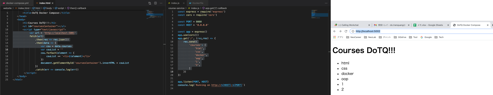
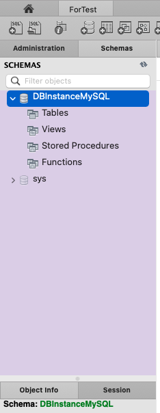

# node-exp-nginx-demo-docker 🧨🚀


[](https://github.com/tquangdo/node-exp-nginx-demo-docker/issues/new)


## deploy local
1. `docker-compose up -d`
2. access browser "localhost:5002"

## [nodejs-mysql-server-demo] folder
1. ### reference
    [hoangnd](https://www.youtube.com/watch?v=BUdQes6c3mM&list=PLWBrqglnjNl3TDF6WKpAl4maE3yJ5CpYF&index=10)
1. ### src code
    - `nodejs-mysql-server-demo/server.js`:
    ```js
    const PORT = 8000 // MUST be 8000
    ```
    1. ### without docker-compose
        ```js
        console.log(`environment's variables: ${JSON.stringify(process.env)}`)
        ```
    1. ### with docker-compose
        ```js
        console.log(`environment's variables: ${JSON.stringify({
            MYSQL_HOST,
            MYSQL_USER,
            MYSQL_PASSWORD,
            MYSQL_DB
        })}`)
        ```
1. ### deploy
    1. ### without docker-compose
        ```shell
        docker build -t img-nodejs-mysql-server-demo .
        docker images
        =>
        REPOSITORY                     TAG       IMAGE ID       CREATED          SIZE
        img-nodejs-mysql-server-demo   latest    d30b3d37e624   20 seconds ago   1.03GB
        docker run -d --name cont-nodejs-mysql-server-demo -p 8002:8000 d30b3d37e624
        ```
    1. ### with docker-compose
        ```shell
        docker-compose -f nodejs-mysql-server-compose.yml up
        =>
        cont-node   | [nodemon] 2.0.15
        cont-node   | [nodemon] to restart at any time, enter `rs`
        cont-node   | [nodemon] watching path(s): server.js
        cont-node   | [nodemon] watching extensions: js,mjs,json
        cont-node   | [nodemon] starting `node server.js`
        cont-node   | Server is listening on 8000
        cont-node   | environment's variables: {"MYSQL_HOST":"MYSQL_HOST","MYSQL_USER":"MYSQL_USER","MYSQL_PASSWORD":"MYSQL_PASSWORD","MYSQL_DB":"MYSQL_DB"}
        cont-node   | 2022-03-30T07:51:38:0250  INFO: GET /xxx
        ```
        - connect by Workbench => will see DBname=`DBInstanceMySQL`
        
1. ### result
    1. #### logs
        ```shell
        docker logs cont-nodejs-mysql-server-demo
        =>
        yarn run v1.22.18
        $ yarn install && nodemon --watch server.js
        [1/4] Resolving packages...
        success Already up-to-date.
        [nodemon] 2.0.15
        [nodemon] to restart at any time, enter `rs`
        [nodemon] watching path(s): server.js
        [nodemon] watching extensions: js,mjs,json
        [nodemon] starting `node server.js`
        Server is listening on 8000
        environment's variables: {"npm_package_dependencies_ronin_server":"^0.1.3",...}
        ```
    1. #### browser (GET)
        - access `localhost:8002/xxx` on browser. Will NOT show json if PORT != 8000
        ```json
            {
                code: "success",
                meta: {
                    total: 0,
                    count: 0
                },
                payload: [ ]
            }
        ```
    1. #### POST
        ```shell
        curl --request POST \
        --url http://localhost:8002/xxx \
        --header 'content-type: application/json' \
        --data '{"name": "Hoang", "content": "How are you" }'
        =>
        {"code":"success","payload":[{"name":"Hoang","content":"How are you","id":"e06c95a4-acf3-4a6a-acf2-88b39b0d207c","createDate":"2022-03-30T05:21:51.759Z"}]}
        ```
        - => will show `INFO: POST /xxx` in docker logs

